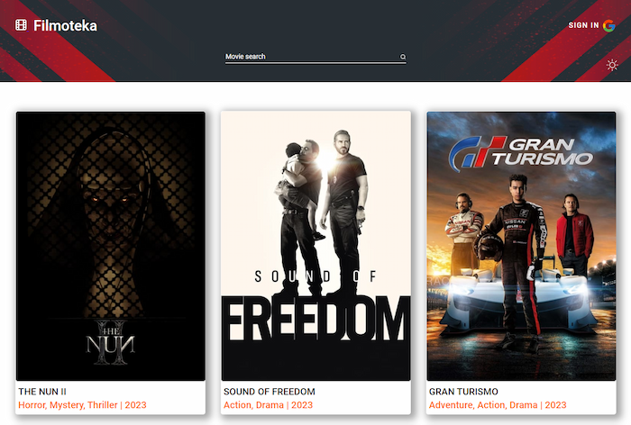
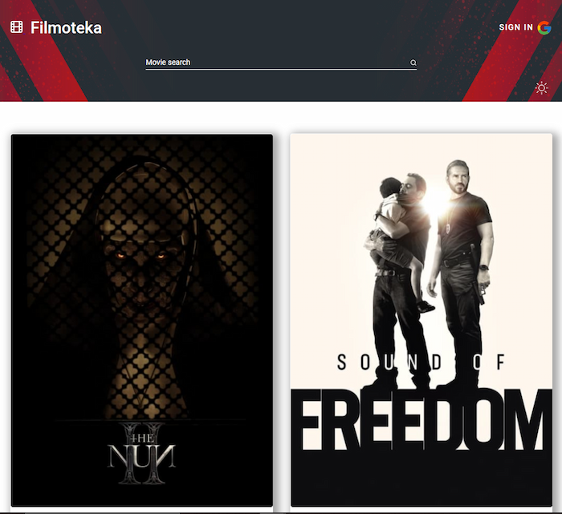
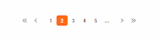
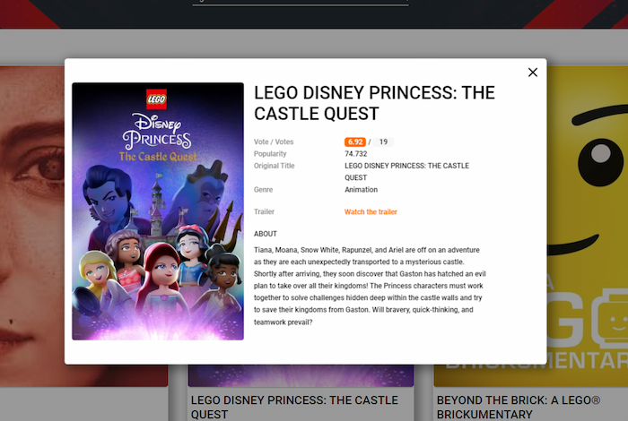
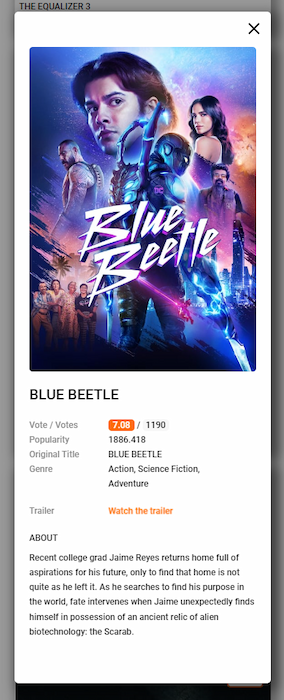
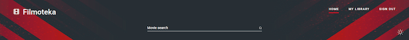
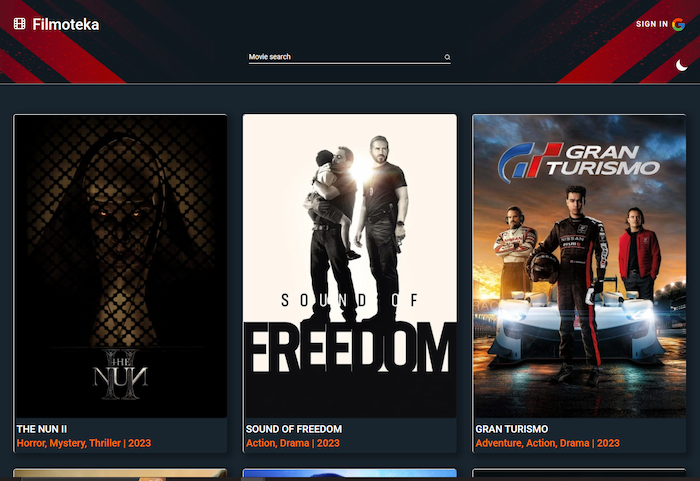

# Filmoteka

Web app based on VanillaJS, using themoviesdb API.

Discover trends, and manage your own movie collection by creating a private
library by logging in using your Google account.

---

## Abouth the Author

Our Team

- [MarikaGK](https://github.com/MarikaGK/)
- [Jakub Lisowski](https://github.com/LisowskiJakub)
- [MarcinBolt](https://github.com/MarcinBolt)
- [Maggie Wesołowska](https://github.com/MaggieWesolowska)
- [Marcinn88](https://github.com/Marcinn88)
- [Alina Bielska](https://github.com/AlinaBielska)
- [Maciej Kudej](https://github.com/maciejkudej)
- [Łukasz996](https://github.com/Lukasz996)
- [Maciej Sorko](https://github.com/MaciejSorko)

---

## Project goal

The aim of the project was to practice working in collaboration, mutual code
review, working with Parcel, Git, and GitHub, as well as using external API,
managing responses and DOM elements.

---

## Contents

- [Technologies used](#technologies-used)
- [Installation](#Installation)
- [Activation](#Activation)
- [Scope of functionality](#Scope-of-functionality)
- [Project status](#Project-status)
- [Sources](#Sources)

---

## Technologies used

- `Vanilla JavaScript` - work in the Parcel environment, with modular
  development components, DOM element management
- `TUI pagination version 3.4.1` - for rendering a collection of popular videos
  and user library
- `Fancybox by Fancyapps version 3.5.7` - modal window for displaying the
  trailer movie
- `Firebase version 0.14.4` - use of database and authorization user using a
  Google account

---

## Installation

To install the application, make sure it is installed on your computer LTS
version of Node.js [Download and install](https://nodejs.org/en/)

Then install all dependencies contained in the file package.json by entering the
`npm install` command in the terminal

---

## Activation

According to the `package.json` documentation, to run the project you need to use the `npm start` command

---

## Scope of functionality

- RWD and user friendly

 

- Follow movie trends: watch trailers, check ratings, movie descriptions, genres

- Search for titles that interest you using the `Search` function\

- Create an account on the website using your Google account

  

- Manage your private video collection by adding to your library with one click
  movies in two queues: `Watched` and `Queue`

  

- Switch light/dark mode

  

#### Todo

- Added the functionality of sorting films by genre

## Project status

The basic version of the project has been completed and the application is
working

## Sources

The project is based on a project created at the GoIT JavaScript Full Stack
bootcamp Developer. It meets the design criteria imposed during the course and
complements them o additional functionalities implemented by our Team (modal
window presenting the trailer, authorization using a Google account via
Firebase, sorting by film genres)
