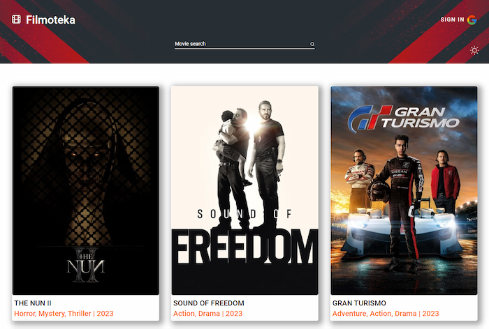
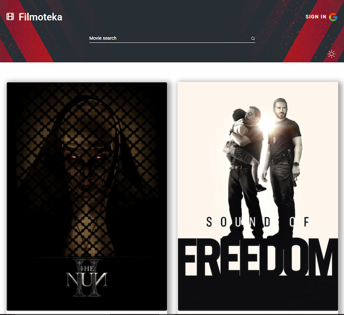
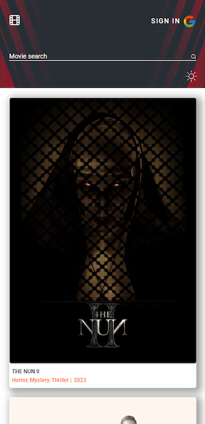
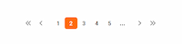
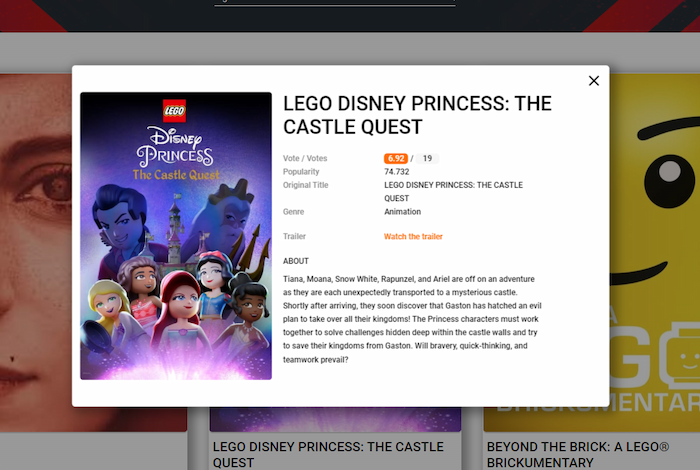
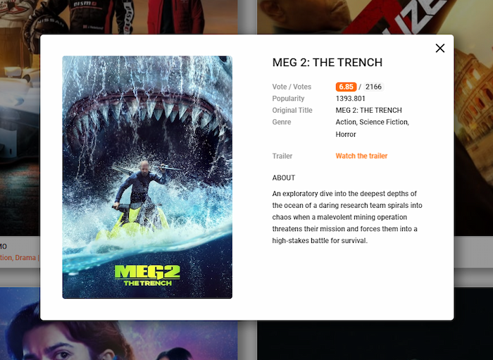
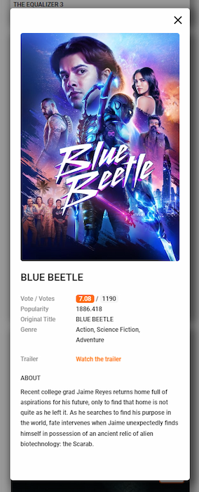
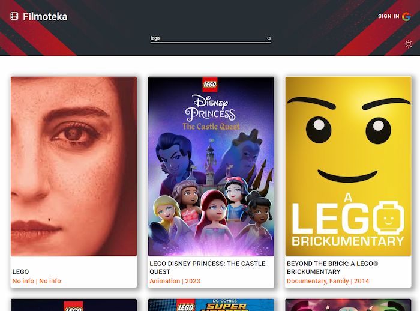
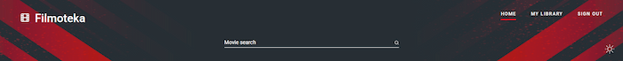
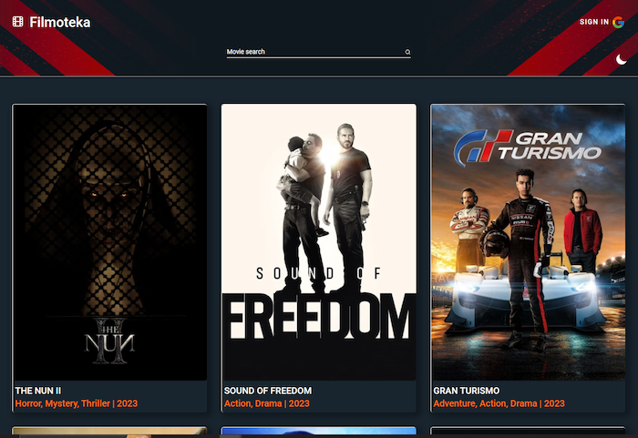

#  Filmoteka ! 

Aplikacja webowa w VanillaJS, korzystająca z API themoviesdb.

Poznawaj trendy, zarządzaj własnym zbiorem filmów, tworząc prywatną bibliotekę,
logując się za pomocą konta Google.

---

## Autor projektu

Zespół projektowy

- [MarikaGK](https://github.com/MarikaGK/)
- [Jakub Lisowski](https://github.com/LisowskiJakub)
- [MarcinBolt](https://github.com/MarcinBolt)
- [Maggie Wesołowska](https://github.com/MaggieWesolowska)
- [Marcinn88](https://github.com/Marcinn88)
- [Alina Bielska](https://github.com/AlinaBielska)
- [Maciej Kudej](https://github.com/maciejkudej)
- [Łukasz996](https://github.com/Lukasz996)
- [Maciej Sorko](https://github.com/MaciejSorko)

---

## Cel projektu

Celem projektu było przećwiczenie pracy w kolaboracji, wzajemnym code review,
praca z Parcel, Git i GitHub, a także korzystanie z zewnętrznego API,
zarządzanie responsami oraz elementami DOM.

---

## Spis treści

- [Zastosowane technologie](#zastosowane-technologie)
- [Instalacja](#instalacja)
- [Uruchomienie](#uruchomienie)
- [Zakres funkcjonalności](#zakres-funkcjonalności)
- [Status projektu](#status-projektu)
- [Źródła](#źródła)

---

## Zastosowane technologie

- `Vanilla JavaScript` - praca w środowisku Parcel, z modułowym tworzeniem
  komponentów, zarządzanie elementami DOM
- `TUI paginacja wersja 3.4.1` - do renderowania zbioru popularnych filmów oraz
  biblioteki użytkownika
- `Fancybox od Fancyapps wersja 3.5.7` - okno modalne do wyświetlania trailera
  filmu
- `Firebase wersja 0.14.4` - wykorzystanie bazy danych oraz utoryzacji
  użytkownika za pomocą konta Google

---

## Instalacja

Aby zainstalować aplikację, upewnij się, że na komputerze zainstalowana jest
wersja LTS Node.js [Ściągnij i zainstaluj](https://nodejs.org/en/)

Następnie należy zainstalować wszystkie dependencies, znajdujące się w pliku
package.json, wpisując w terminal komendę `npm install`

---

## Uruchomienie

Zgodnie z dokumentacją `package.json`, aby uruchomić projekt, należy po
zainstalowaniu npm i wszystkich zależności, użyć komendy `npm start`

---

## Zakres funkcjonalności

- Projekt RWD i user friendly

 

- Obserwuj trendy filmowe: oglądaj trailery, sprawdzaj oceny, opisy filmów,
  gatunki. Zapoznaj się ze szczegółami filmu, otwierając okno modalne po
  kliknięciu na interesujący Cię tytuł lub plakat

  
  
  

- Wyszukuj tytuły, które Cię interesują, korzystając z funkcji `Search`

  

- Załóż konto w serwisie, korzystając ze swojego konta Google

  

- Zarządaj prywatną kolekcją filmów, jednym kliknięciem dodając do biblioteki
  filmy w dwóch kolejkach: `Watched` i `Queue`

  

- Korzystaj z wbudowanego trybu ligh/dark mode

  

#### Todo

- Dodanie funkcjonalności segregowania filmów po gatunkach

## Status projektu

Projekt w wersji podstawowej został ukończony, aplikacja działa

## Źródła

Bazą projektu jest projekt wykonany na bootcampie GoIT JavaScript Full Stack
Developer. Spełnia kryteria projektowe narzucone podczas kursu, uzupełniając je
o wdrożone przez nasz Zespół dodatkowe funkcjonalności (okno modalne
prezentujące trailer, autoryzacja za pomocą konta Google przez Firebase,
sortowanie po gatunkach filmowych)
